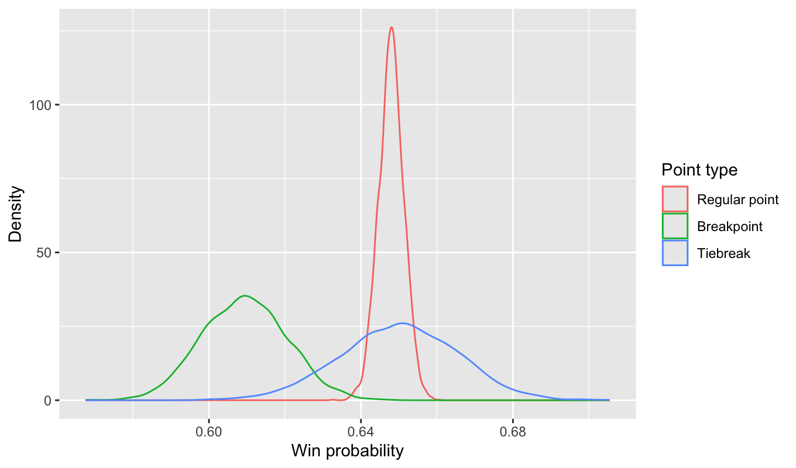
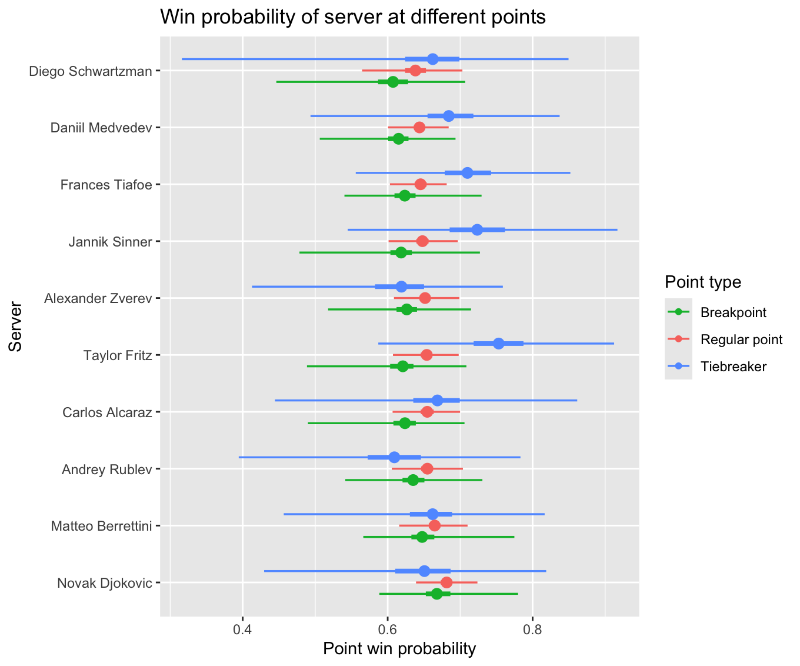

# Bayesian analysis of tennis server win probability

This is a project I did for a Bayesian data analysis course together with two coursemates. The objective of the analysis was to characterize the difference in win probability that the serving player experiences during high-pressure points (breakpoints and tiebreakers).

## Tools

We used Julia and Jupyter Notebooks to clean and explore the data. We did a quick frequentist summary analysis (also in Julia) before moving on to the Bayesian approach. The Bayesian analysis constituted a MCMC simulation performed in _R_ using the [Stan](https://mc-stan.org/) toolkit.

## Analysis

We compared two different models. First, a pooled non-hierarchical model which simply inferred the average point-win-probability of players in three different situations: Serving on a regular point, serving on a breakpoint, and serving on a tiebreaker point. Second, we tested a partially pooled hierarchical model, under which the point-win-probability of each player was kept separate, and the result was a distinct distribution of point-win-probability for each player in each of the three analyzed situations.

## Results

We found a statistically significant decrease in expected point-win-probability for players serving on a breakpoint relative to a regular point. For tiebreaker points, the result was not as clear, mostly owing to the rarity of tiebreaker points, which constituted only around 3% of all points played. A full report can be found [here](BDA%20Project%20Report.pdf).

